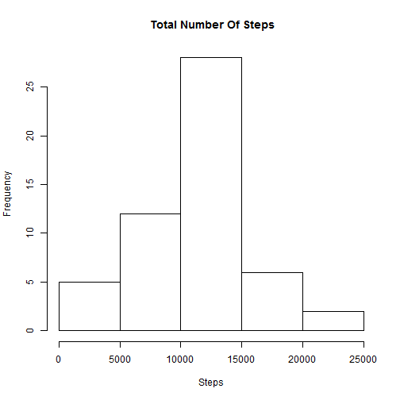
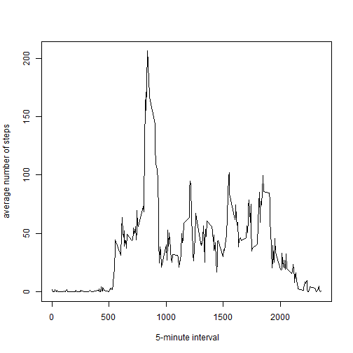
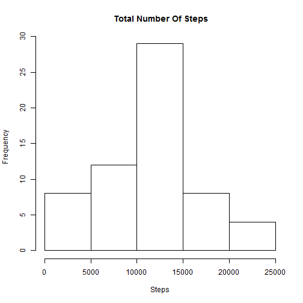
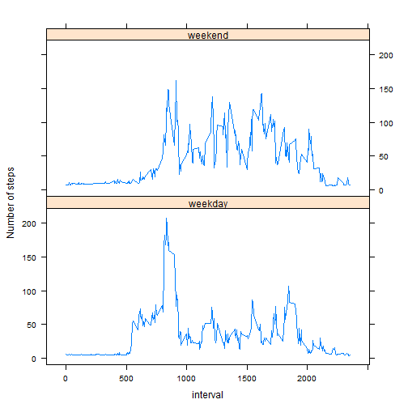

# Reproducible Research : Peer Assessment 1


## Loading and preprocessing the data


```r
data <- read.csv("activity.csv" )
```

## What is mean total number of steps taken per day?

1.  Histogram of the total number of steps


```r
data2 <- aggregate(steps ~ date, data=data, FUN=sum) #
hist(data2$steps, main=" Total Number Of Steps", xlab= "Steps")
```

 

2.   The mean and median total number of steps taken per day


```r
mean1 <- round(mean(data2$steps))
median1 <- median(data2$steps)
paste0("The mean is: ", mean1," and the median is: ", median1  , " steps per day")
```

```
## [1] "The mean is: 10766 and the median is: 10765 steps per day"
```


## What is the average daily activity pattern?

1.  Time series plot 


```r
data3 <- aggregate(steps ~ interval, data=data, FUN=mean) #
with(data3, plot(interval, steps, type="l", xlab=" 5-minute interval", ylab="average number of steps"))
```

 


2.  The 5-minute interval of the maximum number of steps


```r
m <- max(data3$steps)
data4 <- subset(data3, data3$steps==m)
paste0("The maximum number of steps was in 5-minute interval number : ", data4$interval)
```

```
## [1] "The maximum number of steps was in 5-minute interval number : 835"
```


## Imputing missing values

1.  Total number of missing values

```r
a <- sum(is.na(data))
paste0("The total number of missing values is: ", a)
```

```
## [1] "The total number of missing values is: 2304"
```

2.  Impute missing values

* To  impute missing data I use the mean by 5-minute interval. 
* I merge data3 which already contains the mean by interval.


```r
data5<-data
r = merge(data5, data3, by="interval", suffixes=c(".data5", ".data3"))
na.idx = which(is.na(data5$steps))
data5[na.idx,"steps"] = r[na.idx,"steps.data3"]
```

3. Histogram of the total number of steps after missing values were imputed


```r
data52 <- aggregate(steps ~ date, data=data5, FUN=sum) #
hist(data52$steps, main=" Total Number Of Steps", xlab= "Steps")
```

 

4. The mean and median total number of steps taken per day


```r
mean51 <- round(mean(data52$steps))
median51 <- median(data52$steps)
paste0("The mean is: ", mean51," and the median is: ", median51  , " steps per day")
```

```
## [1] "The mean is: 10890 and the median is: 11015 steps per day"
```


* The mean and median calculated after imputing are different from the estimates in the first part of the assignment 

* Imputing data increases the estimates of the total daily number of steps.

## Are there differences in activity patterns between weekdays and weekends?


```r
data5$day <- weekdays(as.Date(data5$date))
data5$dayw <- ifelse(data5$day =="Saturday" | data5$day == "Sunday", "weekend", "weekday" )
data6 <- aggregate(steps ~ interval+dayw , data=data5, FUN=mean)
```


```r
require(lattice)
data6 <- transform(data6, dayw = factor(dayw))
xyplot(steps ~ interval | dayw, data = data6,type="l", ylab="Number of steps",  layout = c(1, 2))
```

 

* There is differences in activity patterns between weekdays and weekends

* The activity seems to be higher on weekends.

